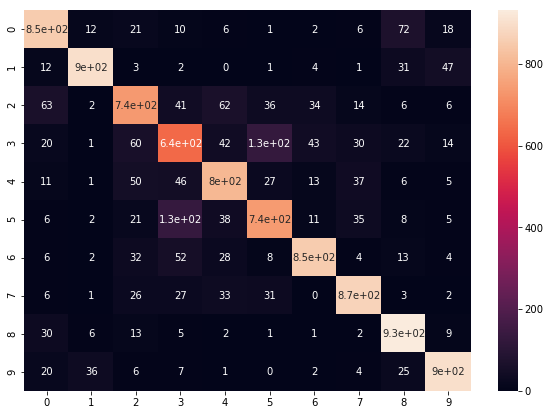
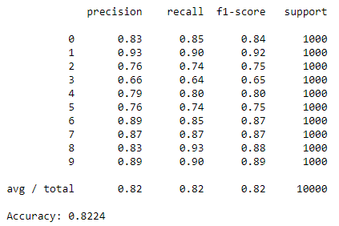
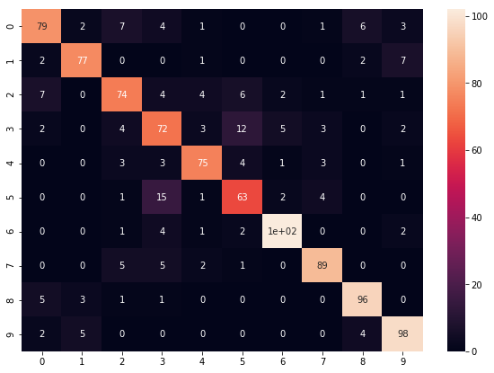
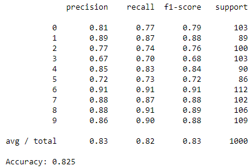
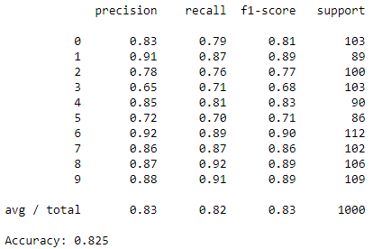
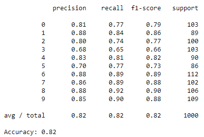

# Keras_Sklearn
Combination of Keras CNN with Scikit-learn classifiers.
This repository provides Cifar10 classification using Keras CNN combined with Scikit-learn classifier.
The CNN itself consists of feature extractor as well as classifier, with convolution and pooling layers work as feature extractor and softmax layer works as classifier.
In this program, I altered softmax layer to support vector machine classifier, random forest classifier and k-nearest neighbor classifier, to evaluate classifier performance of each algorithm compared to softmax.
I used Scikit-learn for the machine learning classifiers.

The architecture is like this.

## Process
This is the steps I take:
1. Define and train CNN, with softmax layer. This will optimize feature extraction layers.
2. Using Keras backend function, I made feature extraction network that output the feature array from input image.

3. Connected each machine learning classifiers to feature extraction network to train to classify the input images according to the feature arrays.

## Comparison
### The evaluation record for CNN with softmax classifier:

### SVM

### Random Forest

### K-nearest neighbor

As you can see, SVM and Random Forest show barely higher accuracy than softmax, and KNN a little beneath it.
