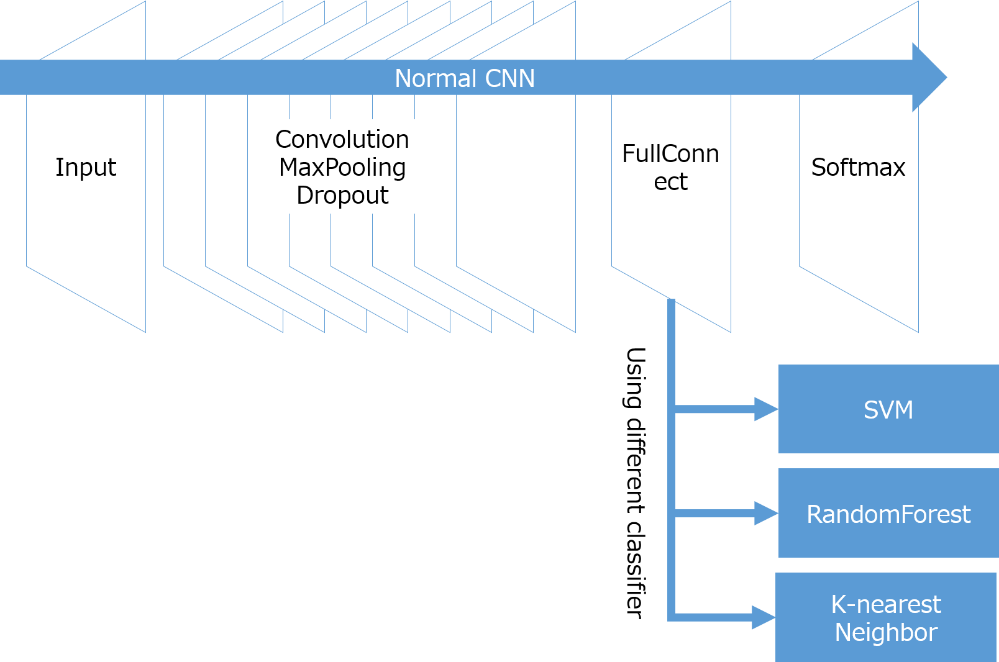

# Keras_Sklearn
Combination of Keras CNN with Scikit-learn classifiers.
This repository provides Cifar10 classification using Keras CNN combined with Scikit-learn classifier.
The CNN itself consists of feature extractor as well as classifier, with convolution and pooling layers work as feature extractor and softmax layer works as classifier.
In this program, I altered softmax layer to support vector machine classifier, random forest classifier and k-nearest neighbor classifier, to evaluate classifier performance of each algorithm compared to softmax.

The architecture is like this.

